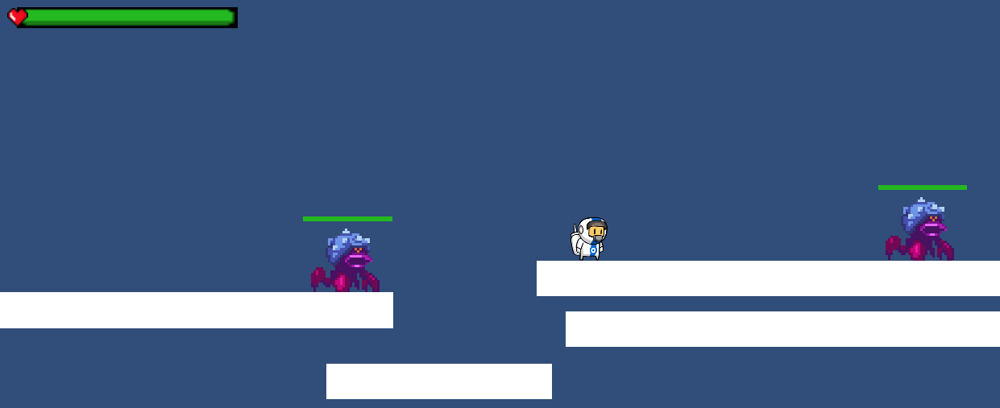

<h1 align="center">2D Portifolio</h1>

A project in Unity using C#

 

     
    
    
    
    
    

 

    <a href="#-about-the-project">About the project</a> •
    <a href="#-license">License</a> •
    <a href="#-contact">Contact</a> 

## 💻 About the project

For this project, I chose a 2D Sidescroller type of gameplay.

I created a Character Controller script from scratch, the character can move sideways, jump, run, crouch and move while crouching.

I created a Combat script, which allows the player to engage enemies in two different ways, melee combat and ranged combat, both are editable to adjust the damage of each weapon.

I also created a Movement script for the enemies as well as a simple AI that makes the enemies increase their speed when they see the player.

To finish the project I added a health system for both player and enemies, this contemplates the in-Unity editable script as well as a HUD, for enemies I also added critical damage when they take damage from behind.

 

#### 2D Sidescroller

 

### Built with
Apart from Unity, I used the following tools to build this project.

- [VisualStudio 2022][visualstudio]

## 📃 License

Distributed under the MIT License. See [LICENSE](./LICENSE) for more information.

## 🌟 Contact

Hey :D

If you wanna get in touch, fell free to contact me at:

[LinkedIn][linkedin]

---

Made by Venicio Augusto 

<!-- LINKS-->

[visualstudio]: https://visualstudio.microsoft.com/vs/
[mysql]: https://www.mysql.com/

[linkedin]: https://www.linkedin.com/in/venicio-augusto/